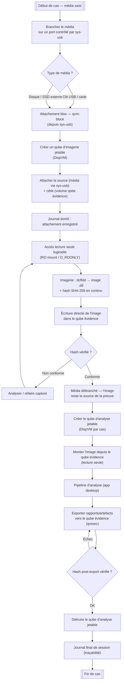
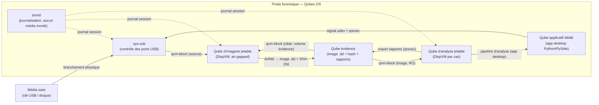
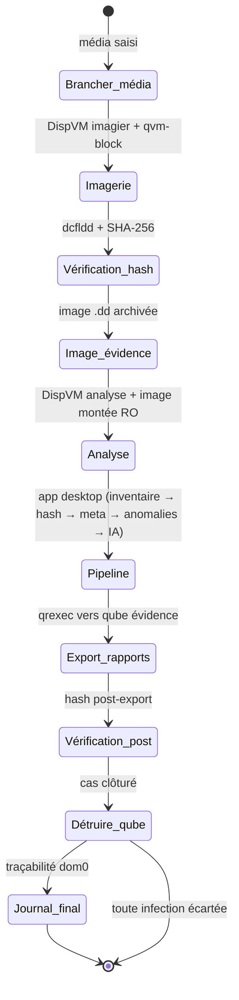
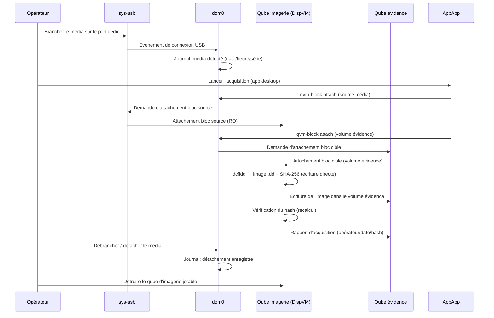
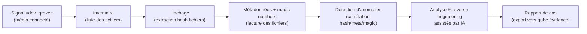
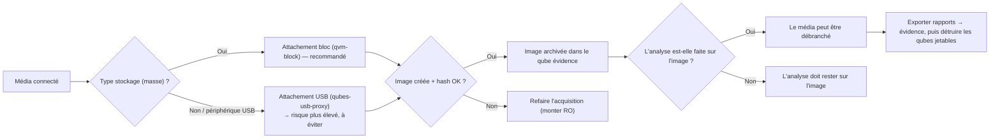

# InSecureDevice — Workflow d'analyse forensique sur Qubes OS

> Diagrammes Mermaid. Pour les visualiser : ouvrir dans VSCode (extension Mermaid),
> Typora, GitHub, ou tout outil compatible Mermaid.

## 1. Vue d'ensemble du workflow

## 2. Isolation & flux système

## 3. Cycle de vie d'un cas (un cas = des qubes jetables)

## 4. Séquence d'acquisition (imagerie forensique)

## 5. Pipeline applicative (app desktop — qube applicatif dédié)

## 6. Décisions / règles de sécurité

